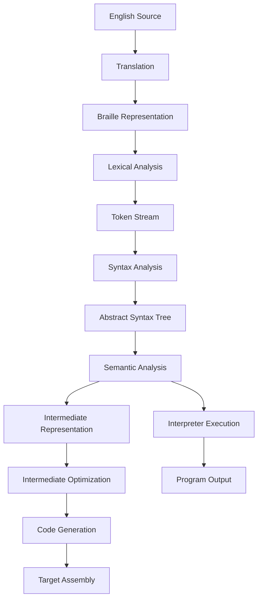
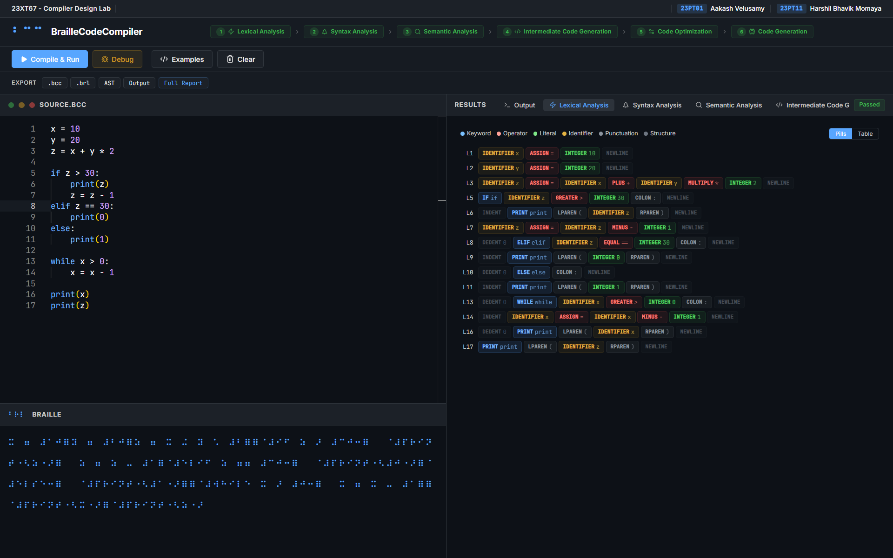
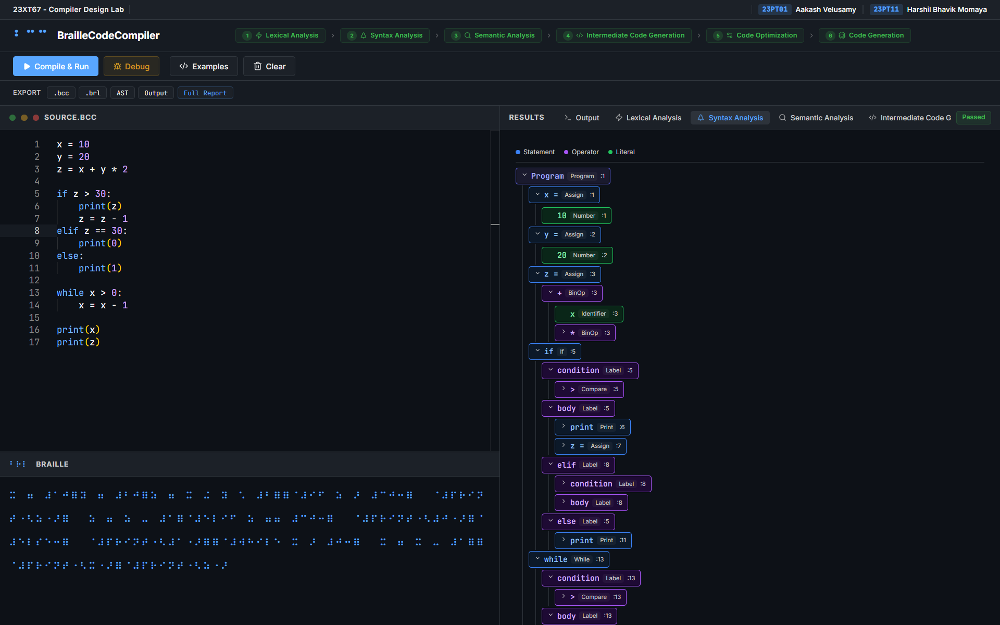
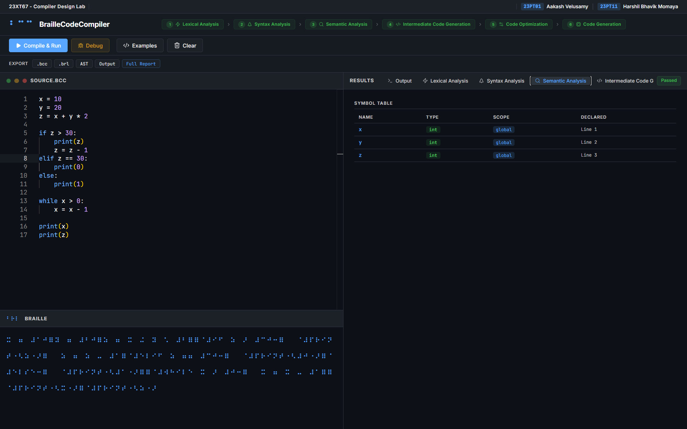
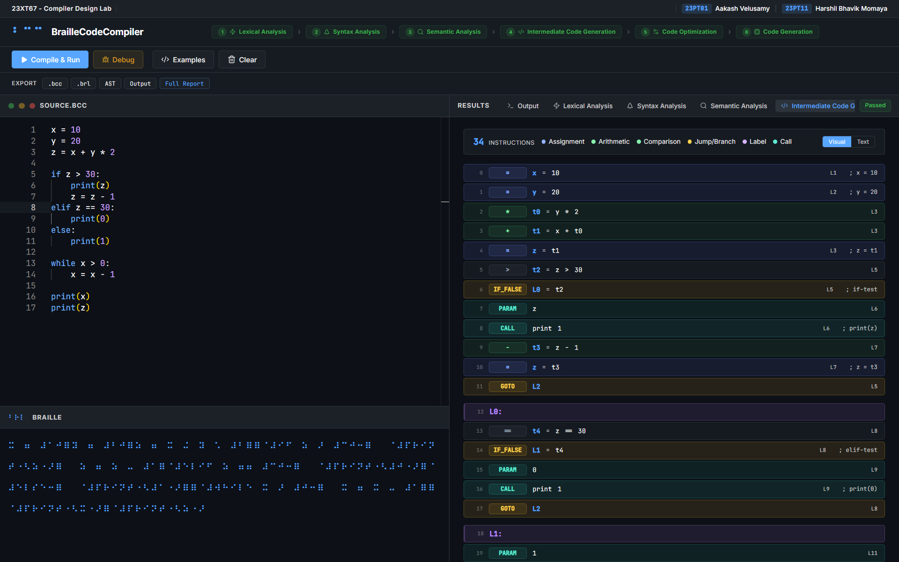
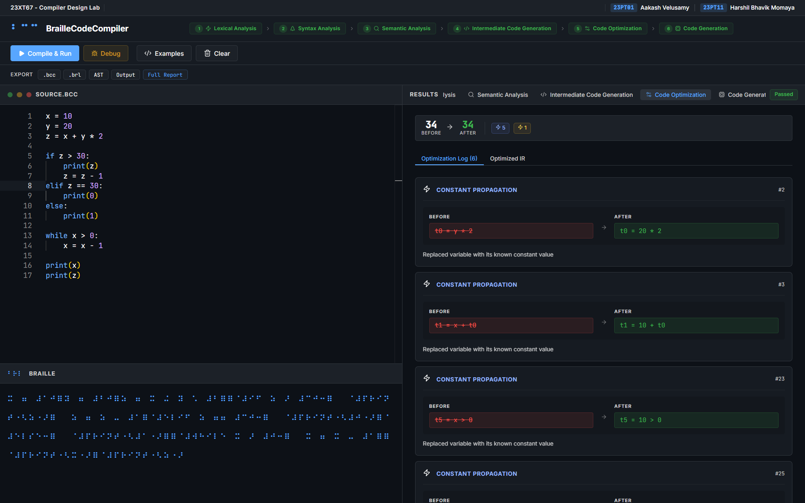
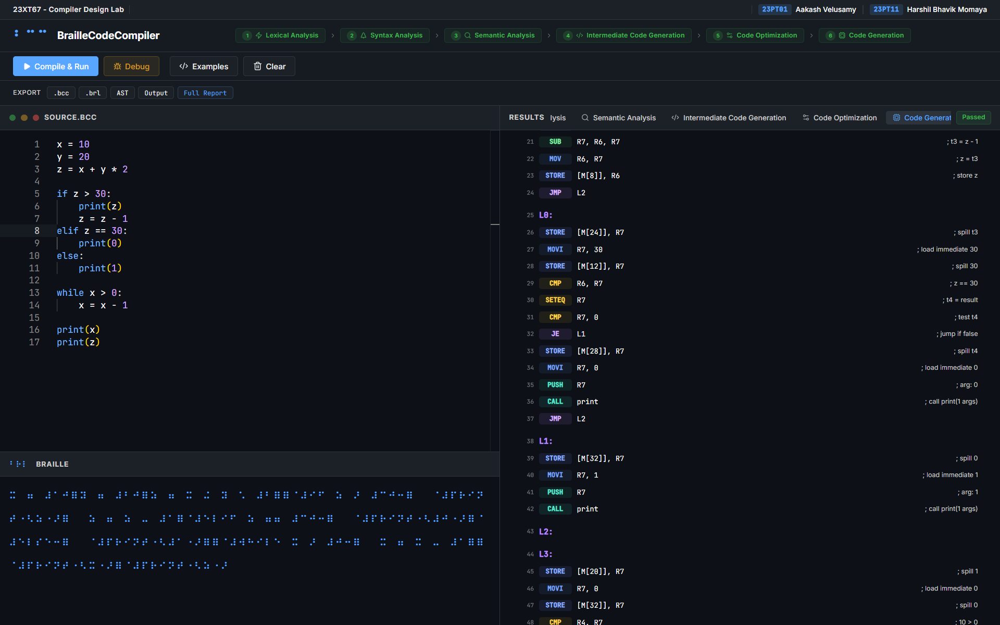
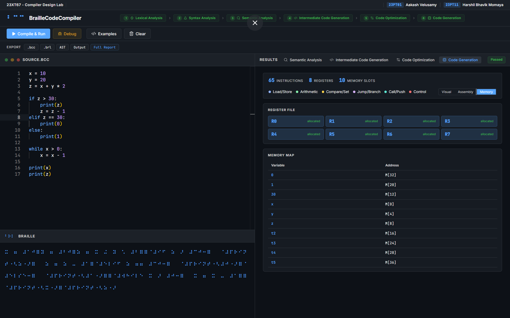

# BrailleCode Compiler System

This project implements a complete compiler pipeline that targets Braille Unicode as the source representation. The system performs a full translation from high level syntax to register allocated pseudo-assembly for a virtual stack machine.

## System Architecture

The following flowchart represents the technical progression of the compilation units through the various stages of the compiler middle-end and back-end.



## Compilation Process

**Source Translation**: The system processes English source strings into equivalent Braille Unicode characters based on Grade 1 Braille standards. This bidirectional mapping ensures that the subsequent scanner operates exclusively on tactile Unicode patterns.

**Lexical Analysis**: The scanner partitions the input stream into a discrete sequence of tokens based on defined regular languages. This process utilizes a stack based algorithm to track indentation depths and emit structural tokens for scope management.



**Syntax Analysis**: A recursive descent parser constructs a hierarchical abstract syntax tree from the token stream. The parser enforces a context free grammar with seven distinct levels of operator precedence to ensure correct expression binding.



**Semantic Analysis**: The analyzer performs a traversal of the tree to enforce language constraints and maintain symbol tables. It conducts type inference and identifies undeclared variable references across nested lexical scopes.



**Intermediate Representation**: The system lowers the validated tree into a machine independent three address code format. This representation linearizes the program flow and facilitates the implementation of optimization algorithms.



**Intermediate Optimization**: The middle-end executes constant folding and dead code elimination on the intermediate representation. These passes refine the instruction sequence to improve runtime efficiency and reduce the final memory footprint.



**Target Code Generation**: The back-end translates optimized intermediate instructions into pseudo-assembly for a virtual machine. A linear scan allocator manages register assignments across the eight available registers and handles memory spilling when register pressure is high.



**Runtime Execution**: The interpreter performs a tree walk evaluation of the final program state. It maintains a runtime environment for variable storage and captures output streams while enforcing safety limits on loop iterations.



## Setup and Installation

### Backend Environment

```bash
cd backend
python -m venv venv
venv\Scripts\activate
pip install -r requirements.txt
python manage.py runserver
```

### Frontend Environment

```bash
cd frontend
npm install
npm start
```

### Test Suite Execution

```bash
python -m tests.test_translator
python -m tests.test_lexer
python -m tests.test_parser
python -m tests.test_analyzer
python -m tests.test_interpreter
```
